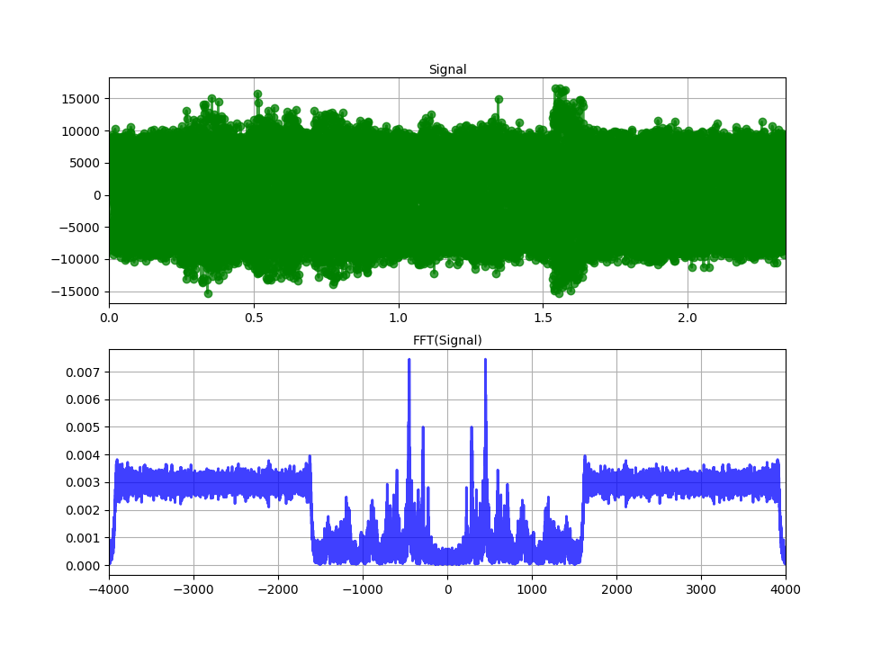
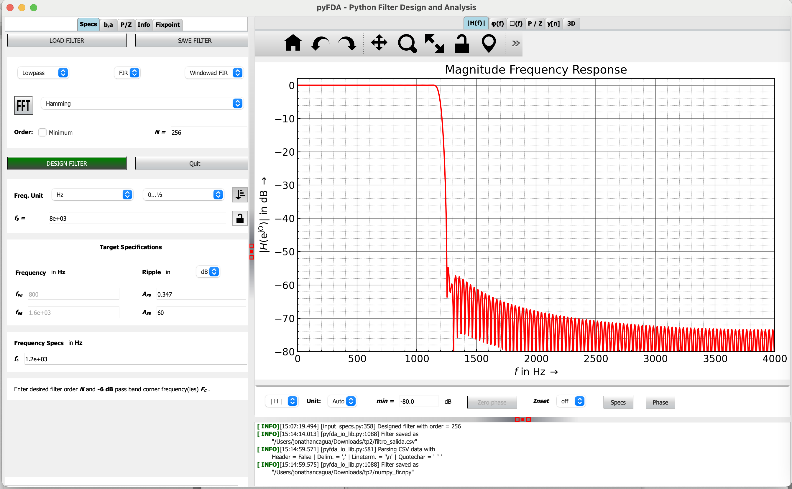
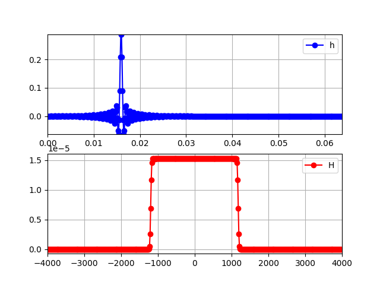

# Ejercicio con CIAA.
Dado el segmento de audio almacenado en el archivo clases/tp2/chapu_noise.npy con Fs=8000, mono de 16b y contaminado con ruido de alta frecuencia: 
- Diseñe un filtro que mitigue el efecto del ruido y permita percibir mejor la señal de interés 
- Filtre con la CIAA utilizando alguna de las técnicas vistas 
- Grafique el espectro antes y después del filtro. 
- Reproduzca el audio antes y después del filtro 
- Pegue el link a un .zip comentando los resultados y los criterios utilizados, la plantilla del filtro con capturas de la herramienta de diseño y un video mostrando la CIAA/HW en acción y la reproducción de audio antes y después del filtrado.
## Kit usado
El kit usado es B-L475E-IOT01A1.<br>
## Respuestas
Se hace unas graficas de la senal:<br>

Al ver el espectro se ve que nuestra senal se encuentra entre 0-1500hz, se debe filtrar esa frecuencias.
### Diseñe un filtro que mitigue el efecto del ruido y permita percibir mejor la señal de interés.
Se hace uso de pyFDA para el diseno del filtro el cual se puede apreciar su respuesta en frecuencia.<br>

<br> Cuando se crea el filtro en C



### Grafique el espectro antes y después del filtro. 
aplicando convolucion se obtiene los siguientes resultados.


### Pruebas de convolucion en Python

Se hizo las primeras pruebas en python para revisar el filtro.
```python
import simpleaudio as sa
import numpy as np
import matplotlib.pyplot as plt

#--------------------------------
fs = 8000
muestra = np.load("data/chapu_noise.npy")
N = len(muestra)

#-------------------------
filtro_test = np.array(np.load('./data/numpy_fir.npy')[0]).astype(float)
filtered = np.convolve(filtro_test, muestra)
#se repdroducd el audio luego del filtrado
#playObj = sa.play_buffer(np.array(np.real(filtered), np.int16), 1, 2, fs * 1)
#playObj.wait_done()
#-----------------------
N_ = len(filtro_test)
nData_ = np.arange(0, N, 1)
fData_ = nData_ * (fs / N) - (fs / 2)

nData = np.arange(0, N, 1)
fData = nData * (fs / N) - (fs / 2)
#---------------------------------------------------------
fig = plt.figure()
muestra_ax = fig.add_subplot(3, 1, 1)
muestra_ax.set_xlim(0, N / fs)
muestra_ax.set_title("muestra", rotation = 0, fontsize = 10, va ="center")
plt.plot(nData / fs, muestra, 'g-o', linewidth = 2, alpha = 0.75)
plt.grid()
#---------------------------------------------------------
espectro = np.fft.fft(muestra)
espectro_ax = fig.add_subplot(3, 1, 2)
espectro_ax.set_xlim((-fs / 2) - (fs / N), (fs / 2) + (fs / N))
espectro_ax.set_title("FFT(muestra)", rotation = 0, fontsize = 10, va ="center")
plt.plot(fData, np.abs(np.fft.fftshift(espectro) / N ** 2), 'b-', linewidth = 2, alpha = 0.75)
plt.grid()
#-----------------------------
convAxe         = fig.add_subplot(3,1,3)
convolveNData = np.arange(0, len(filtered), 1)
convolveTData = convolveNData/fs
convLn,       = plt.plot(convolveTData, filtered, 'r-', label ="muestra-filtro", linewidth = 6, alpha = 0.5)
#convAxe.legend()
convAxe.grid(True)
convAxe.set_xlim(0,convolveTData[-1])

#se escucha antes del filtro
#playObj = sa.play_buffer(np.array(np.real(np.fft.ifft(espectro)), np.int16), 1, 2, fs * 1)
#playObj.wait_done()

plt.show()
```


### Implementacion en la Placa
```c
#include "arm_math.h"
#include "arm_const_structs.h"
#include "class3.h"
#include "adc.h"
#include "dac.h"
#include "usart.h"
#include "fir.h"
#define NUCLEO_CLOCK_SPEED 80000000U

#define BITS    10   // cantidad de bits usado para cuantizar

uint32_t tick   = 0   ;
uint16_t tone   = 100 ;
uint16_t B      = 2500;
uint16_t sweept = 5;
 int16_t offset = 512;
 int16_t zero = 0;

struct header_struct {
   char     pre[8];
   uint32_t id;
   uint16_t N;
   uint16_t fs ;
   uint16_t hLength ;
   char     pos[4];
} __attribute__ ((packed)); //importante para que no paddee

static struct header_struct header={"*header*",0,256,8000,h_LENGTH,"end*"};

static uint32_t cyclesCounterRead( void );
static void cyclesCounterReset( void );
static void cyclesCounterInit( void );
static uint32_t adcRead();
static void dacWrite(uint16_t value);

static void trigger(int16_t threshold)
{
   while((adcRead()-512)>threshold)
      ;
   while((adcRead()-512)<threshold)
      ;
   return;
}


void class3_1_main(){
   uint16_t sample = 0;
   int16_t adc   [ header.N            ];
   int16_t y     [ h_LENGTH+header.N-1 ]; //
   cyclesCounterInit();
   while(1) {
      cyclesCounterReset();

      adc[sample]       = (((int16_t )adcRead()-512)>>(10-BITS))<<(6+10-BITS);          // PISA el sample que se acaba de mandar con una nueva muestra
      if ( ++sample==header.N ) {
         sample = 0;
//------------CONVOLUCION------------------
         arm_conv_fast_q15  ( adc,header.N,h,h_LENGTH,y); //126+74-1
//------------ENVIO DE TRAMA------------------
         header.id++;
         HAL_UART_Transmit(&huart1,(uint8_t*)&header ,sizeof(struct header_struct ),1);
         for (int i=0;i<(header.N+h_LENGTH-1 );i++) {
        	 HAL_UART_Transmit(&huart1,(uint8_t* )(i<header.N?&adc[i]:&offset ),sizeof(adc[0]),1);
        	 HAL_UART_Transmit(&huart1,(uint8_t* )(i<h_LENGTH?&h  [i]:&zero   ),sizeof(h[0])  ,1);
        	 HAL_UART_Transmit(&huart1,(uint8_t* )(           &y  [i]         ),sizeof(y[0])  ,1);
         }
      }

      while(cyclesCounterRead()< NUCLEO_CLOCK_SPEED/header.fs) // el clk de la CIAA es 204000000
         ;
   }
}
```