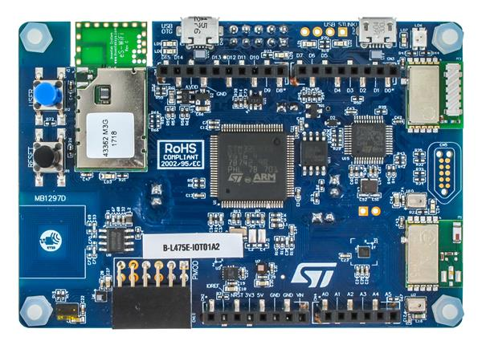

# materia de sistemas operativos.
## Kit usado
El kit usado es B-L475E-IOT01A1

## Ide usado
Se usa STM32CubeIDE y CMSIS directo sin librerias HAL.
## Implementaciones del SO

El sistema operativo incluye:

- Manejador de tareas con prioridad
- Colas
- Manejo de interrupciones
- Semaforos
### Creando tareas
El llamado para la creacion de tareas es la siguiente:
- Puntero a data de la tarea.
- Inicializar el os.
- Crear la tarea.
El codigo de ejemplo es el de accontinuacion.

```c
struct task_block *task_block1;
os_init();
task_block3 = task_create("tarea3", task3, (void *)&valor,3);
```

### Creando Cola
El llamado para la creacion de colas es la siguiente:
- Puntero a data de la tarea.
- Inicializar el os.
- Crear la tarea.
El codigo de ejemplo es el de accontinuacion.

```c
struct queue queue_task1;

void task1(void *arg)
{
	int i=0;
	while (1) {
		queue_write(&queue_task1, &i);
		task_delay_s(3);
	}
}

void task2(void *arg)
{
	int j;
	while (1) {
		queue_read(&queue_task1, &j);
		printf("task2 recibe porl a cola de task 1 = %d \n\r",j);
	}
}

int main(void)
{
    //Creacion de tareas.
    queue_init(&queue_task1, sizeof(uint32_t));
}
```